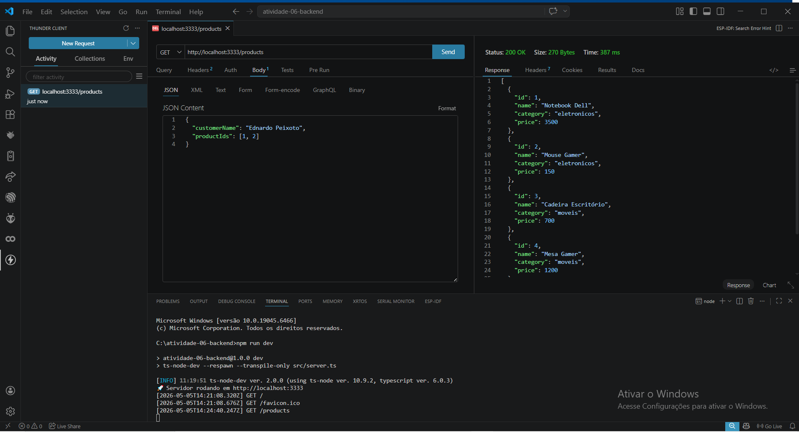
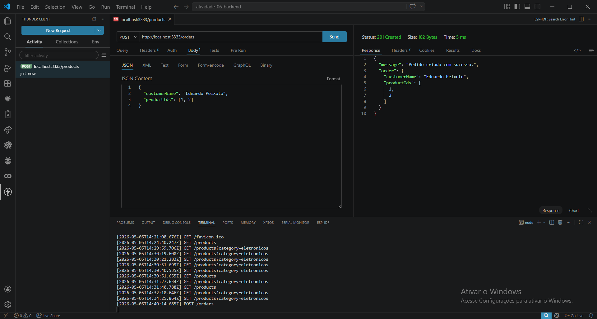

# 🚀 Atividade 06 - API REST com Express e TypeScript

<p align="center">
  
  
  
  
</p>

---

## 📌 Descrição

API REST desenvolvida com **Express + TypeScript** com foco em:

- Semântica REST
- Manipulação de Query Params, Route Params e Body JSON
- Uso de Middlewares
- Boas práticas com organização de rotas

---

## 🧰 Tecnologias Utilizadas

- Node.js
- Express
- TypeScript
- CORS
- ts-node-dev

---

## 🔗 Endpoints da API

### 📦 Produtos

| Método | Rota | Descrição |
|------|------|----------|
| GET | `/products` | Lista todos os produtos |
| GET | `/products?category=eletronicos` | Filtra por categoria |
| GET | `/products/:id` | Busca produto por ID |

---

### 🛒 Pedidos

| Método | Rota | Descrição |
|------|------|----------|
| POST | `/orders` | Cria um novo pedido |
| PATCH | `/orders/:id` | Atualiza o status do pedido |
| DELETE | `/orders/:id` | Remove um pedido |

---

## 🧠 Middlewares

- 📌 **Logger** → Exibe no terminal:


- 📌 **Validação de Body** → Retorna erro 400 se o corpo estiver vazio

---

## 🧪 Testes da API

### 📦 Listagem de produtos


### 🔍 Filtro por categoria


### 📄 Produto por ID


### ❌ Erro: Corpo vazio (400)


---

### 🛒 Criar pedido (POST)


### ❌ Erro body vazio


### 🔄 Atualizar pedido (PATCH)


### 🗑️ Deletar pedido (DELETE)


---

## 📦 Exemplo de Body (POST /orders)

```json
{
  "customerName": "Ednardo Peixoto",
  "productIds": [1, 2]
}


---

## 🚀 Como executar

```md
## 🚀 Como executar o projeto

```bash
# instalar dependências
npm install

# rodar servidor
npm run dev

📍 Servidor disponível em:
http://localhost:3333


---

## 🎯 Conceitos

```md
## 🎯 Conceitos Aplicados

- ✔ Semântica REST (GET, POST, PATCH, DELETE)
- ✔ Query Params (`req.query`)
- ✔ Route Params (`req.params`)
- ✔ Body JSON (`req.body`)
- ✔ Status Codes HTTP
- ✔ Middlewares personalizados
- ✔ Organização com `express.Router()`

## 👨‍💻 Autor

Ednardo Pinheiro Peixoto

## ⭐ Observação

Este projeto foi desenvolvido como atividade prática para consolidar conceitos de backend com Node.js e Express.